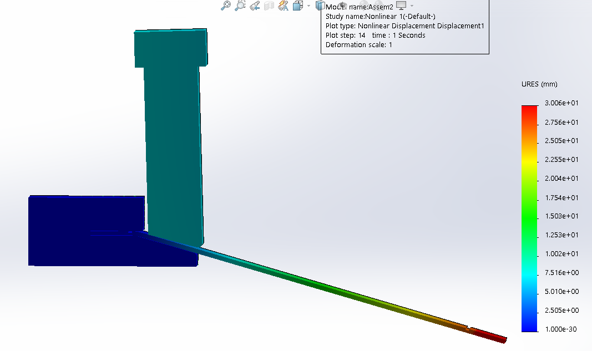

# Mechatronics Engineering
With 8+ years of experience in manufacturing and production environments, including electronics assembly, machinery operation, and process improvement. Skilled in IPC-compliant assembly, documentation, and quality control. Now based in Petone, I’m excited to contribute to a forward-thinking projects.

## KEY SKILLS 
- Prototyping & Troubleshooting
- CAD Design (SolidWorks, Ansys, AutoCAD)
- PCB Design (Altium Designer, KiCad, Eagle CAD)
- Lean Manufacturing (FMEA, RCA, SPC)
- Automation & Control systems (Festo FluidSim, SIMATIC S7, PLC Programming & Microcontroller)

## Projects
### MCAD for assembly instructions @ GPV Lanka
#### What?
Complex assembly instructions on paper is harder for operators to completely understand. Create interactive visual work instruction for each process step.
#### How?
Used **SolidWorks composer** to model complex assembly. Using **Aegis’ Factory Logix MES** created step-by-step animated assembly instructions.
#### Results
Reduced training and skill requirements for new operators. Reduced delay and cost due to assembly mistakes.

### FEA simulation for PCB bending tool @ GPV Lanka
#### What?
Design a tool to bend the aluminum PCB 12˚inwards from both ends at a distance of 11mm. Predict the requited tool angle to compensating for the spring back.
#### How?
Used **SolidWorks** to model the tool. 
Required tool angel was determined as 16˚ using FEA tools. Press tool slipping during bending was identified, tool design was updated with guiding pins.
#### Results
Fabricated the tool according to simulation results. The tool provided the required bend without damaging PCB surface. Reduced material and time consumption for tool production and verification.

### Statistical process control @ GPV Lanka
#### What?
Statistical process control for continuous improvement. Determine how raw material parameter change effect end product FPY 
#### How?
Gather material, process, environment and product test result data. Use data analysis tools like **Minitab** to determine correlation. Use SPC to measures and controls quality.
 #### Results
Improving product quality and consistency, reducing waste and rework. Enhancing productivity and efficiency and supporting continuous improvement and innovation.
### Lean production layout @ GPV Lanka
#### What?
Production layout change according to material flow. Spaghetti diagram for current layout. Predict the optimal layout for available space.
#### How?
Cread digital CAD drawing of the complete area. Arrange production sections according to material flow.
#### Results
### Return loop automation @ hirdaramani industries
#### What?
Automate loop sewing and ironing process. Reduce operator requirement and improve consistency and quality.
#### How?
Used SolidWorks to design the sewing machine attachment for automation. Designed a control system for automated operation.
#### Results
Operator's requirement reduced from two full time operators to one operator for initial set up. Increased efficiency and quality.
### Automated label cutter @ hirdaramani industries
#### What?
Manual label cutting process needed automation. The machine should allow different label lengths and label amount cutting. Increase label cutting efficiency and accuracy.
#### How?
Designed an automated machine to detect the black color line on label bottom side. Programmed the stepper motor rotation stop at the cutting blade. Designed an interface for operator to input required label count.
#### Results
Fully automated label cutting machine catering for required label quantity and label length. Operator's requirement reduced from one full time operators to one operator for initial set up.
### Back Pocket Bag Facing Disposal @ hirdaramani industries
#### What?
The sewing operation is paused while the operator disposed the sewed garment piece. Increase machine operation time.
#### How?
Designed an automated system to dispose the sewed garment pieces.
#### Results
Increased sewing machine operation time. Increased operator efficiency and productivity. 
### Pleating machine @ hirdaramani industries
#### What?
Automate the manual pleating (cardboard line embossing) process. Increase process accuracy.
#### How?
Designed a semi-automated system with bending head and lease guide for the operator to correctly place the cardboard.
#### Results
Increased operator efficiency and productivity.
### Ball Mill Machine @ hirdaramani industries
#### What?
Design a machine to stone wash (tumble washing) fabrics.
#### How?
Fabricated a barrel and motor linkage system according to the requirements.
Designed a 3-phase motor Reverse Forward Star Delta control system.
#### Results
Automated stone washing machine.
