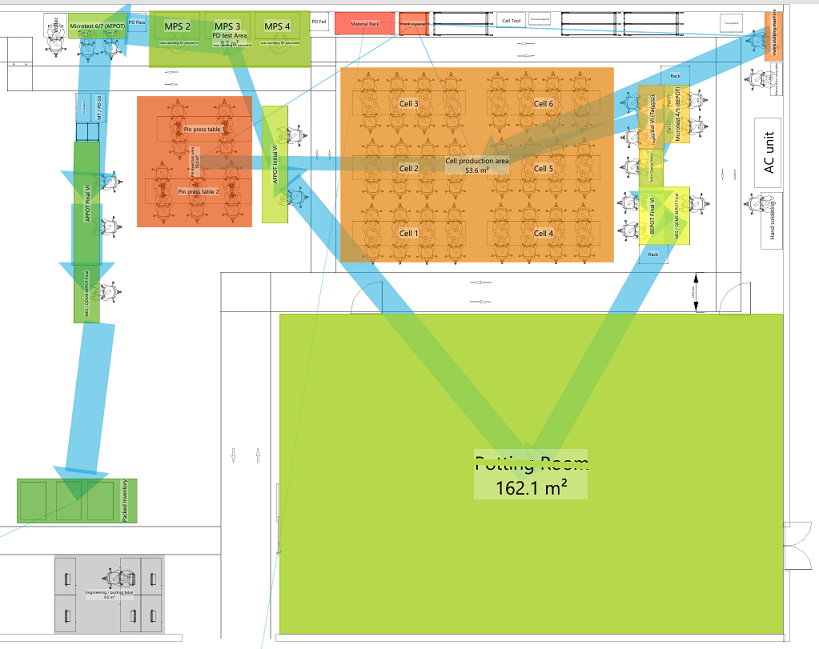

# Mechatronics Engineering
I'm Nipuna, an engineer with hands-on experience in CAD and PCB design, embedded systems, prototyping and process optimization. I enjoy solving real-world problems through smart design and clear documentation. This portfolio showcases some of the personal and professional projects I've worked on. I’m always looking to learn, build, and contribute to meaningful projects.

## Projects
### Interactive Assembly Instructions – Pilot Project | GPV Lanka
Designed and implemented interactive step-by-step assembly instructions for complex PCB, cable, and mechanical housing assemblies using SolidWorks Composer and Aegis FactoryLogix MES. Instructions were displayed on touchscreen stations in the mechanical assembly area, guiding operators visually through each process including precise part placement and torque specs. As the project lead, I created 3D mechanical models and integrated them into the MES system. The pilot reduced training needs and minimized assembly errors, demonstrating the potential of MES-driven visual workflows.

*Assembly instructions dispaly in Aegis FactoryLogix MES* 

*Exploded_BOM_view in SolidWorks Composer* 
### Production-deployed SCARA automation system integrated into electronics manufacturing line | GPV Lanka
Led the design and implementation of a DOBOT M1 SCARA robotic system to automate transformer pin dip-tinning operations in an IPC-compliant electronics manufacturing environment. The project began with a SolidWorks-based workstation layout design, defining the spatial arrangement of the robot, custom transformer input tray, solder pot, and output tray, which was later refined during implementation. I was responsible for robot installation, calibration, and commissioning, as well as experimental optimisation of Z-height and dwell time parameters. The system was programmed initially via the DOBOT interface and later using Python with a hard-coded 16-transformer batch sequence, performing pick → dip (row 1) → 180° rotation → dip (row 2) → place operations. Thermal safety was addressed through enclosure exhaust integration and heat protection measures. The automation leveraged the robot’s ±0.02 mm repeatability to improve process consistency, positional accuracy, and operator safety compared to manual tinning.

*Initial workstation layout concept designed in SolidWorks prior to physical implementation* 

*Exploded_BOM_view in SolidWorks Composer* 
### FEA-Based PCB Bending Tool Design | GPV Lanka
As the NPI engineer, designed and simulated a manual bending tool to meet product requirements for a 12° inward bend on aluminum PCBs. Used SolidWorks and FEA to determine a 16° tool angle to account for spring-back, and updated the design with guide pins to prevent slipping. The tool was successfully fabricated and deployed in production, achieving accurate bends without surface damage and reducing development time and material use.

*Aluminum PCB bending simulation using SolidWorks FEA tool* 

*SolidWorks tool design and deployed tool in production* 

### Statistical Process Control – Transformer Manufacturing | GPV Lanka
Led SPC initiatives to enhance first pass yield (FPY) in the production of transformers. Collected and analyzed process, material, and environmental data—including ferrite core AL values, wire and core lot traceability, and epoxy curing conditions—using Minitab and statistical tools. Conducted experiments to identify root causes of FPY variation. This resulted in improved product quality, reduced rework, and more efficient fault identification and resolution.

*Data analyzed using Excel,Minitab and Spotfire Statistica* 

### Digital Layout Redesign with visTABLE – Transformer Production | GPV Lanka
Led the redesign of the transformer production layout using visTABLE to support lean manufacturing and digital planning initiatives. Utilized CAD-based modeling and spaghetti diagram analysis to optimize operator and material flow across the production floor. The implemented layout reduced movement between operations, improved space utilization, and contributed to the company’s digital transformation toward data-driven factory planning.

*Layout arrange according to Material flow* 

*3D layout for visualization* 

### Re-engineered Chlorine Dosing Controller | Personal Project
Reengineered the functionality of a failed De Nora MicroChem®3 chlorine dosing controller used in a water treatment system. Designed a custom Arduino shield PCB to read a 4–20 mA chlorine sensor input and control a DC dosing valve with encoder feedback. Developed the complete embedded solution, including hardware and firmware, to replicate and improve the original system’s behavior using threshold-based actuation logic. Successfully deployed in a live plant environment, providing a reliable, cost-effective alternative that remained in operation for several years.

### Power-On Fan Reset Automation – Hotel Room Application | Personal Project
Developed a custom PCB using an ATtiny85 microcontroller to automate fan recovery after power interruptions in hotel rooms. The board interfaces with a tactile button panel and simulates a triple-press sequence via BJT switching to restore full fan speed without manual input. Designed the hardware and firmware to ensure seamless post-outage operation. Successfully deployed in a live hotel environment, eliminating guest complaints and reducing manual resets by staff.

*Fan reset PCB designe* 

### Automated Label Cutter | Hirdaramani Industries
Designed and built a standalone automated label cutting machine to replace a manual process and improve efficiency in garment manufacturing. The system uses an IR sensor to detect black guide lines on labels and controls a stepper motor to stop precisely at the cutting point. A microcontroller with a motor controller manages motor control and a user interface with a keypad and LCD screen, allowing operators to input label length and quantity. The solution significantly improved cutting accuracy and reduced the need for full-time operator involvement, supporting leaner production workflows.

*Automated Label Cutter* 
