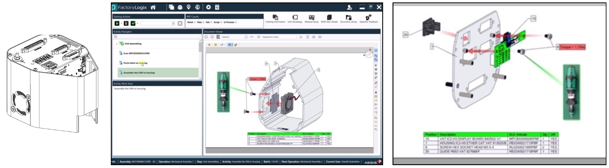

# Mechatronics Engineering
With 8+ years of experience in manufacturing and production environments, including electronics assembly, machinery operation, and process improvement. Skilled in IPC-compliant assembly, documentation, and quality control. Now based in Petone, I’m excited to contribute to a forward-thinking projects.

## KEY SKILLS 
- Prototyping & Troubleshooting
- CAD Design (SolidWorks, Ansys, AutoCAD)
- PCB Design (Altium Designer, KiCad, Eagle CAD)
- Lean Manufacturing (FMEA, RCA, SPC)
- Automation & Control systems (Festo FluidSim, SIMATIC S7, PLC Programming & Microcontroller)

## Projects
### Interactive Assembly Instructions – Pilot Project | GPV Lanka
Designed and implemented interactive step-by-step assembly instructions for complex PCB, cable, and mechanical housing assemblies using SolidWorks Composer and Aegis FactoryLogix MES. Instructions were displayed on touchscreen stations in the mechanical assembly area, guiding operators visually through each process including precise part placement and torque specs. As the project lead, I created 3D mechanical models and integrated them into the MES system. The pilot reduced training needs and minimized assembly errors, demonstrating the potential of MES-driven visual workflows.

### FEA-Based PCB Bending Tool Design | GPV Lanka
As the NPI engineer, designed and simulated a manual bending tool to meet product requirements for a 12° inward bend on aluminum PCBs. Used SolidWorks and FEA to determine a 16° tool angle to account for spring-back, and updated the design with guide pins to prevent slipping. The tool was successfully fabricated and deployed in production, achieving accurate bends without surface damage and reducing development time and material use.

### Statistical Process Control – Transformer Manufacturing | GPV Lanka
Led SPC initiatives to enhance first pass yield (FPY) in the production of transformers. Collected and analyzed process, material, and environmental data—including ferrite core AL values, wire and core lot traceability, and epoxy curing conditions—using Minitab and statistical tools. Conducted experiments to identify root causes of FPY variation. This resulted in improved product quality, reduced rework, and more efficient fault identification and resolution.

### Digital Layout Redesign with visTABLE® – Transformer Production | GPV Lanka
Led the redesign of the transformer production layout using visTABLE to support lean manufacturing and digital planning initiatives. Utilized CAD-based modeling and spaghetti diagram analysis to optimize operator and material flow across the production floor. The implemented layout reduced movement between operations, improved space utilization, and contributed to the company’s digital transformation toward data-driven factory planning.

### Return loop automation @ hirdaramani industries
#### What?
Automate loop sewing and ironing process. Reduce operator requirement and improve consistency and quality.
#### How?
Used SolidWorks to design the sewing machine attachment for automation. Designed a control system for automated operation.
#### Results
Operator's requirement reduced from two full time operators to one operator for initial set up. Increased efficiency and quality.
### Automated label cutter @ hirdaramani industries
#### What?
Manual label cutting process needed automation. The machine should allow different label lengths and label amount cutting. Increase label cutting efficiency and accuracy.
#### How?
Designed an automated machine to detect the black color line on label bottom side. Programmed the stepper motor rotation stop at the cutting blade. Designed an interface for operator to input required label count.
#### Results
Fully automated label cutting machine catering for required label quantity and label length. Operator's requirement reduced from one full time operators to one operator for initial set up.
### Back Pocket Bag Facing Disposal @ hirdaramani industries
#### What?
The sewing operation is paused while the operator disposed the sewed garment piece. Increase machine operation time.
#### How?
Designed an automated system to dispose the sewed garment pieces.
#### Results
Increased sewing machine operation time. Increased operator efficiency and productivity. 
### Pleating machine @ hirdaramani industries
#### What?
Automate the manual pleating (cardboard line embossing) process. Increase process accuracy.
#### How?
Designed a semi-automated system with bending head and lease guide for the operator to correctly place the cardboard.
#### Results
Increased operator efficiency and productivity.
### Ball Mill Machine @ hirdaramani industries
#### What?
Design a machine to stone wash (tumble washing) fabrics.
#### How?
Fabricated a barrel and motor linkage system according to the requirements.
Designed a 3-phase motor Reverse Forward Star Delta control system.
#### Results
Automated stone washing machine.
